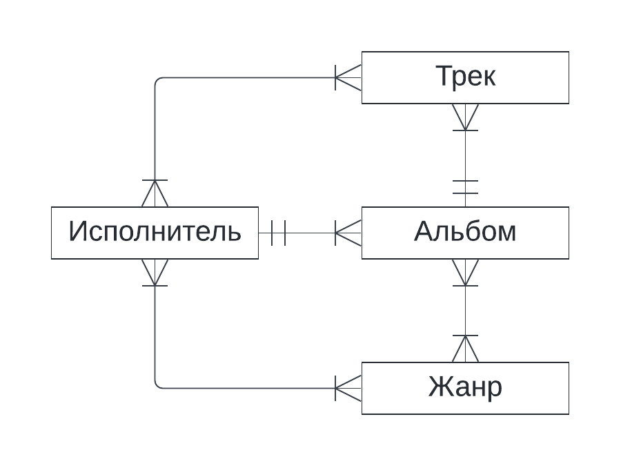
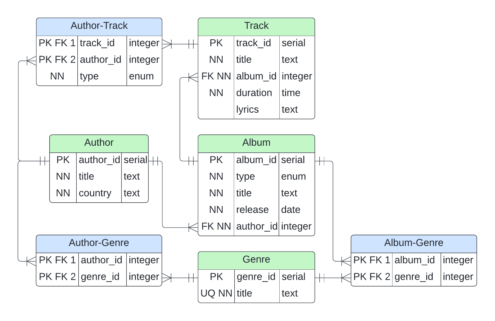

# Разработка структуры БД

## Цели работы
Познакомиться с основами проектирования схемы БД, способами организации данных в SQL-БД.

## Программа работы
1. Создание проекта для работы в GitLab.
2. Выбор задания (предметной области), описание набора данных и требований к хранимым данным в свободном формате в wiki своего проекта в GitLab.
3. Формирование в свободном формате (предпочтительно в виде графической схемы) схемы БД, соответствующей заданию. Должно получиться не менее 7 таблиц.
4. Согласование с преподавателем схемы БД. Обоснование принятых решений и соответствия требованиям выбранного задания.
5. Выкладывание схемы БД в свой проект в GitLab.
6. Демонстрация результатов преподавателю.

## Ход работы

Выбранная предметная область &mdash; музыкальный стриминговый сервис или музыкальная библиотека.
Хранит информацию о треках, альбомах, исполнителях, жанрах.

### Концептуальная модель

#### Трек:
* Альбом
* Исполнители (1+, т. к. бывают совместные треки)

#### Альбом:
* Треки
* Исполнитель
* Жанры

#### Исполнитель:
* Треки
* Альбомы
* Жанры

#### Жанр:
* Исполнители
* Альбомы

С использованием вышеперечисленных сущностей и связей между ними составлена концептуальная ER-диаграмма в нотации Crow's Foot.

#### Концептуальная ER-диаграмма

Эта диаграмма представляет **концептуальную** модель базы данных. Модель является абстрактной, и во внимание ставятся только
сущности и связи между ними, откуда и идёт название диграммы &mdash; Сущность-Связь (*англ.* **E**ntity-**R**elationship).
Связи между сущностями не подписаны ввиду своей очевидности и экономии места.

Далее для каждой сущности нужно составить соответствующую таблицу/отношение &mdash; определить набор атрибутов, их флаги и типы данных.

### Даталогическая модель

Для всех первичных ключей выбран тип `serial` &mdash; целочисленный тип данных, обеспечивающий уникальность и
автоинкрементирование идентификаторов записей таблицы.

#### Исполнитель

| Флаг  |  Атрибут  |  Тип   | Комментарий                                       |
|:-----:|:---------:|:------:|:--------------------------------------------------|
|  PK   | author_id | serial | Первичный ключ  &mdash; идентификатор исполнителя |
|  NN   |   title   |  text  | Непустое имя исполнителя                          |
|  NN   |  country  |  text  | Непустая страна происхождения исполнителя         |

#### Альбом

| Флаг  |  Атрибут  |   Тип   | Комментарий                                             |
|:-----:|:---------:|:-------:|:--------------------------------------------------------|
|  PK   | album_id  | serial  | Первичный ключ  &mdash; идентификатор альбома           |
|  NN   |   type    |  enum   | Тип альбома: альбом, сингл, EP                          |
|  NN   |   title   |  text   | Непустое название альбома                               |
|  NN   |  release  |  date   | Непустая дата релиза альбома                            |
| FK NN | author_id | integer | Непустой внешний ключ &mdash; идентификатор исполнителя |

Для типа альбома `type` использован тип данных `enum`, поскольку все возможные типы альбомов известны заранее
(перечислены в комметарии к соответствующему атрибуту).

#### Трек

| Флаг  | Атрибут  |   Тип   | Комментарий                                         |
|:-----:|:--------:|:-------:|:----------------------------------------------------|
|  PK   | track_id | serial  | Первичный ключ &mdash; иденификатор трека           |
|  NN   |  title   |  text   | Непустое название трека                             |
| FK NN | album_id | integer | Непустой внешний ключ &mdash; идентификатор альбома |
|  NN   | duration |  time   | Непустая длительность трека                         |
|       |  lyrics  |  text   | Слова песни (трек может быть без слов)              |

#### Жанр

| Флаг  | Атрибут  |  Тип   | Комментарий                                |
|:-----:|:--------:|:------:|:-------------------------------------------|
|  PK   | genre_id | serial | Первичный ключ &mdash; идентификатор жанра |
| UQ NN |  title   |  text  | Уникальное непустое название жанра         |

Название жанра уникально (флаг `UQ`), т. к. не может (по крайней мере, не должно) существовать два жанра с одинаковым названием
(две записи с одинаковым значением атрибута `title`).

#### Таблицы-связки

Для реализации связей многие-ко-многим используются таблицы-связки, в общем случае реализуемые по-разному, в данном случае так:
* Таблица содержит 2 атрибута &mdash; идентификаторы записей таблиц, которые она связывает (их первичные ключи)
* Каждый из этих двух атрибутов одновременно является и внешним, и первичным ключом:
  * Роль внешнего ключа: ссылается на идентификатор записи (первичный ключ) связуемой таблицы
  * Роль первичного ключа: используется для обращения связуемой таблицы к таблице-связке
* 2 атрибута составляют единый композитный первичный ключ, идентифицирующий запись в таблице-связке

В базе данных используются 3 таблицы-связки: Альбом-Жанр, Исполнитель-Жанр, Исполнитель-Трек. Первые две таблицы-связки
имеют структуру, описанную выше. В таблицу-связку Исполнитель-Трек добавлен атрибут `type` &mdash; тип авторства,
имеющий тип данных `enum`, т. к. типы авторства известны заранне: основной, совместный, ремикс.

#### Даталогическая ER-диаграмма

## Выводы

В ходе лабораторной работы теоретически и практически изучен первый этап разработки БД &mdash; разработка её структуры 
(проектировние концептуальных и даталогических схем). Изучена нотация Crow's Foot, а также основные флаги атрибутов и 
типы данных в PostgreSQL при проектировании даталогической схемы. Концептуальная схема более абстракта и позволяет на 
верхнем уровня, не вдаваясь в подробности реализации, оценить и установить связи между сущностями БД. Даталогическая схема
уже использует реляционную модель данных, т. е. сущность представляется как отношение/таблица с набором атрибутов, их флагами
и типами данных, а связи между сущностями (таблицами) реализуются через определённые их атрибуты (первичные и внешние ключи).
Имея даталогическую схему, уже не составит почти никакого труда создать БД с помощью SQL-запросов.