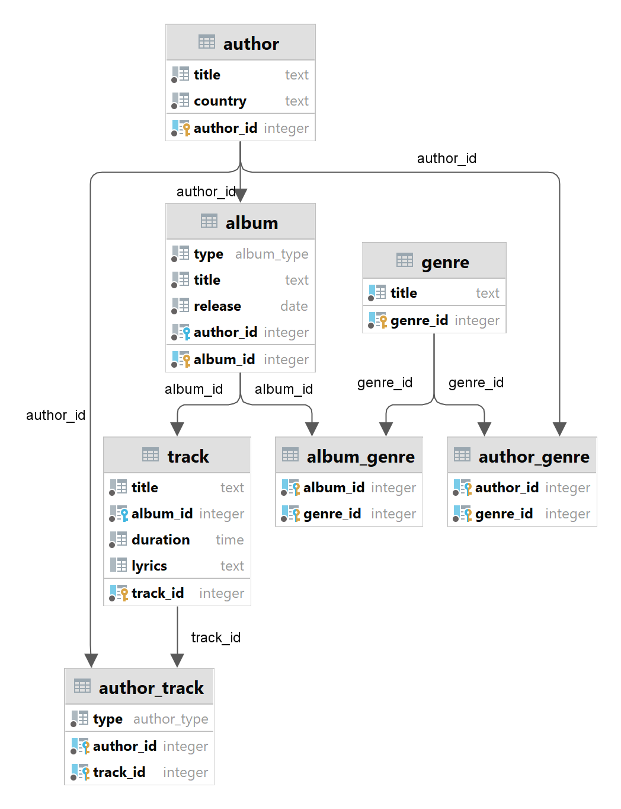
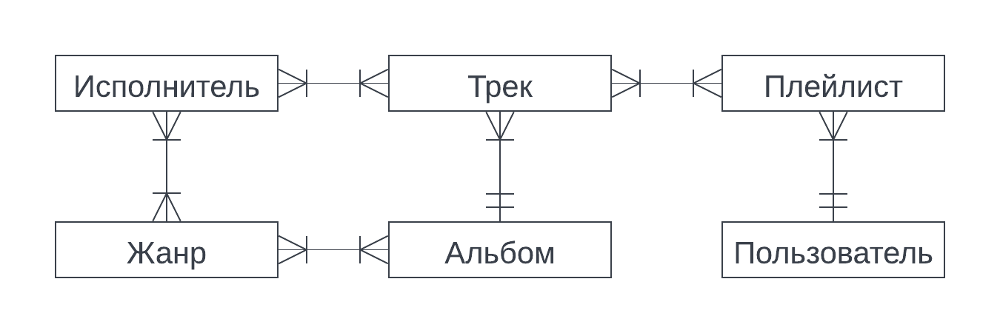
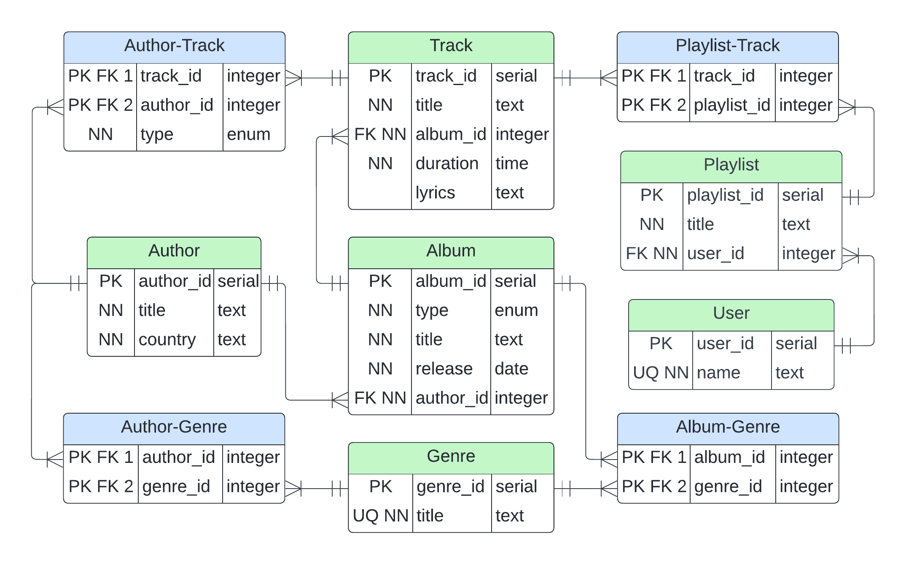
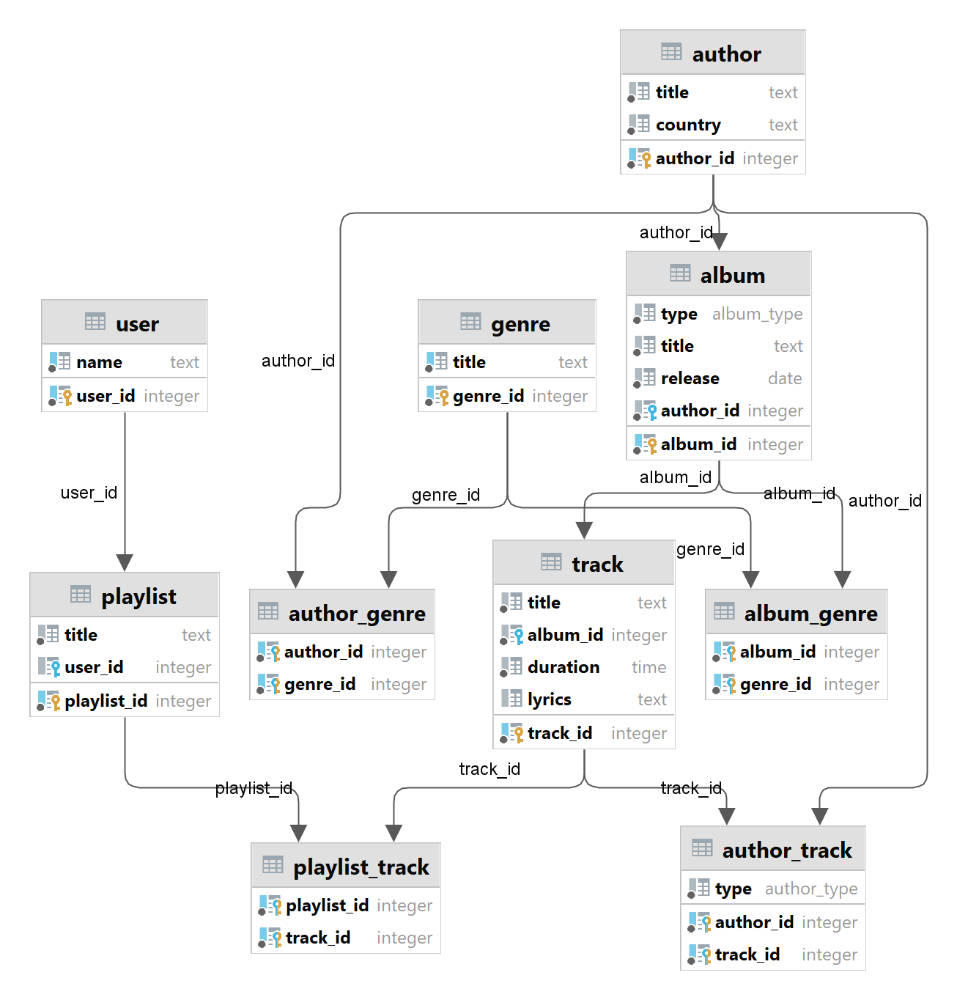

# Язык SQL DDL

## Цели работы
Познакомиться с основами проектирования схемы БД, языком описания сущностей и ограничений БД SQL-DDL.

## Программа работы
1. Самостоятельное изучение SQL-DDL.
2. Создание скрипта БД в соответствии с согласованной схемой. Должны присутствовать первичные и внешние ключи, ограничения на диапазоны значений. Демонстрация скрипта преподавателю.
3. Создание скрипта, заполняющего все таблицы БД данными.
4. Выполнение SQL-запросов, изменяющих схему созданной БД по заданию преподавателя. Демонстрация их работы преподавателю.

## Ход работы

Все написанные SQL-скрипты расположены в папке [sql](./sql).

### Создание таблиц

[create.sql](sql/create.sql)

Для всех внешних ключей использована опция `ON DELETE CASCADE`. Это обеспечивает удаление записи из "дочерней" таблицы, если
была удалена запись из "родительской" таблицы, на первичный ключ которой ссылался внешний ключ (`parent.parent_id` == `child.parent_id`).
В данной БД такое поведение обосновано для всех отношений между таблицами: без альбома не может быть трека, без автора не может быть альбома и т. д.

Также рассмотрены различные синтаксические конструкции для объявления внешнего ключа:
* `author_id INT NOT NULL, FOREIGN KEY (author_id) REFERENCES author (author_id) ON DELETE CASCADE` &mdash;
сначала объявление атрибута, потом объявление внешнего ключа с указанием атрибута текущей таблицы и атрибута таблицы, 
на который ссылается внешний ключ;
* `album_id INT NOT NULL REFERENCES album (album_id)` &mdash; 
объявление внешнего ключа при объявлении атрибута с указанием атрибута внешней таблицы, на который ссылается внешний ключ;
* `author_id INT REFERENCES author ON DELETE CASCADE` &mdash; указание таблицы, на которую ссылается внешний ключ
(возможно в том случае, когда имена внешнего ключа и атрибута внешней таблицы, на который он ссылается, совпадают);

#### Исполнитель

```sql
CREATE TABLE IF NOT EXISTS author (
    author_id SERIAL PRIMARY KEY,
    title TEXT NOT NULL,
    country TEXT NOT NULL
);
```

#### Альбом

```sql
CREATE TYPE album_type AS ENUM ('album', 'single', 'EP');

CREATE TABLE IF NOT EXISTS album (
    album_id SERIAL PRIMARY KEY,
    type album_type NOT NULL,
    title TEXT NOT NULL,
    release DATE NOT NULL,
    author_id INT NOT NULL,
    FOREIGN KEY (author_id) REFERENCES author (author_id) ON DELETE CASCADE
);
```

#### Трек

```sql
CREATE TABLE IF NOT EXISTS track (
    track_id SERIAL PRIMARY KEY,
    title TEXT NOT NULL,
    album_id INT NOT NULL REFERENCES album (album_id) ON DELETE CASCADE,
    duration TIME NOT NULL,
    lyrics TEXT
);
```

#### Жанр

```sql
CREATE TABLE IF NOT EXISTS genre (
    genre_id SERIAL PRIMARY KEY,
    title TEXT NOT NULL UNIQUE
);
```

#### Таблицы-связки

```sql
CREATE TABLE IF NOT EXISTS album_genre (
    album_id INT REFERENCES album ON DELETE CASCADE,
    genre_id INT REFERENCES genre ON DELETE CASCADE,
    PRIMARY KEY (album_id, genre_id)
);

CREATE TABLE IF NOT EXISTS author_genre (
    author_id INT REFERENCES author ON DELETE CASCADE,
    genre_id INT REFERENCES genre ON DELETE CASCADE,
    PRIMARY KEY (author_id, genre_id)
);

CREATE TYPE author_type AS ENUM('main', 'feat', 'remix');

CREATE TABLE IF NOT EXISTS author_track (
    author_id INT REFERENCES author ON DELETE CASCADE,
    track_id INT REFERENCES track ON DELETE CASCADE,
    PRIMARY KEY (author_id, track_id),
    type author_type NOT NULL
);
```

В таблицах-связках указание `NOT NULL` для внешних ключей необязательно, т. к. они являются и первичными ключами, что
исключает `NULL`.

В IntelliJ IDEA есть возможность визуализировать диаграмму БД:



Убеждаемся, что диаграмма созданной БД совпадает с диаграммой, составленной в лабораторной работе 1.1.

### Заполнение таблиц

[fill.sql](sql/fill.sql)

```sql
INSERT INTO author (title, country)
VALUES ('Rammstein', 'Germany'), ('Dream Theater', 'USA'), ('Charlie Clouser', 'USA');

INSERT INTO genre (title)
VALUES ('Industrial'), ('Industrial metal'), ('Progressive metal'), ('Progressive rock'), ('Electronic');

INSERT INTO author_genre (author_id, genre_id)
VALUES (1, 1), (1, 2), (3, 2), (3, 5);

CALL insert_author_genre('Dream Theater', 'Progressive metal');
CALL insert_author_genre('Dream Theater', 'Progressive rock');

INSERT INTO album (type, title, release, author_id)
VALUES ('album', 'A View From The Top Of The World', '2021-10-22', 2),
       ('album', 'Remixes', '2020-03-27', 1),
       ('single', 'Deutschland', '2019-03-28', 1);

INSERT INTO album_genre (album_id, genre_id)
VALUES (1, 3), (2, 1), (3, 2);

INSERT INTO track (title, album_id, duration, lyrics)
VALUES ('Stripped', 2, '00:05:12', 'Let me see you stripped down to the bone'),
       ('Deutschland', 3, '00:05:22', Null);

INSERT INTO track (title, album_id, duration)
VALUES ('The Alien', 1, '00:09:31'),
       ('Answering the Call', 1, '00:07:35'),
       ('Invisible Monster', 1, '00:06:30'),
       ('Sleeping Giant', 1, '00:10:04'),
       ('Transcending Time', 1, '00:06:24'),
       ('Awaken the Master', 1, '00:09:47'),
       ('A View from the Top of the World', 1, '00:20:23');

INSERT INTO author_track (author_id, track_id, type)
VALUES (1, 1, 'main'), (3, 1, 'remix'), (1, 2, 'main');

INSERT INTO author_track (author_id, track_id, type)
VALUES (2, 3, 'main'), (2, 4, 'main'), (2, 5, 'main'), (2, 6, 'main'), (2, 7, 'main'), (2, 8, 'main'), (2, 9, 'main');
```

Для дополнительного ознакомления с возможностями SQL была созданна процедура для добавления записи в таблицу `author-genre`
(добавление жанра исполнителю) по именам исполнителя и жанра [create_procedures.sql](sql/create_procedures.sql).

Несмотря на большее удобство и репрезентативность с точки зрения человека, вручную заполняющего таблицы, такая процедура
более трудоёмкая, чем просто запрос `INSERT` с использованием идентификаторов исполнителя и жанра, а также не подходит
для случаев, когда существует два или более исполнителя с одинаковым названием (жанр будет присвоен всем сразу).
Использование идентификаторов хоть и является менее репрезентативным, но всё же исключает такие ситуации,
т. к. идентификаторы (первичные ключи) всегда уникальны.

#### Исполнитель

| author_id | title           | country |
|----------:|:----------------|:--------|
|         1 | Rammstein       | Germany |
|         2 | Dream Theater   | USA     |
|         3 | Charlie Clouser | USA     |

#### Альбом

| album_id | type   | title                            | release    | author_id |
|---------:|:-------|:---------------------------------|:-----------|----------:|
|        1 | album  | A View From The Top Of The World | 2021-10-22 |         2 |
|        2 | album  | Remixes                          | 2020-03-27 |         1 |
|        3 | single | Deutschland                      | 2019-03-28 |         1 |

#### Трек

| track_id | title                            | album_id | duration | lyrics                                   |
|---------:|:---------------------------------|---------:|:---------|:-----------------------------------------|
|        1 | Stripped                         |        2 | 00:05:12 | Let me see you stripped down to the bone |
|        2 | Deutschland                      |        3 | 00:05:22 | NULL                                     |
|        3 | The Alien                        |        1 | 00:09:31 | NULL                                     |
|        4 | Answering the Call               |        1 | 00:07:35 | NULL                                     |
|        5 | Invisible Monster                |        1 | 00:06:30 | NULL                                     |
|        6 | Sleeping Giant                   |        1 | 00:10:04 | NULL                                     |
|        7 | Transcending Time                |        1 | 00:06:24 | NULL                                     |
|        8 | Awaken the Master                |        1 | 00:09:47 | NULL                                     |
|        9 | A View from the Top of the World |        1 | 00:20:23 | NULL                                     |

#### Жанр

| genre_id | title             |
|---------:|:------------------|
|        1 | Industrial        |
|        2 | Industrial metal  |
|        3 | Progressive metal |
|        4 | Progressive rock  |
|        5 | Electronic        |

#### Таблицы-связки

**author_genre**

| author_id | genre_id |
|----------:|---------:|
|         1 |        1 |
|         1 |        2 |
|         3 |        2 |
|         3 |        5 |
|         2 |        3 |
|         2 |        4 |

**album_genre**

| album_id | genre_id |
|---------:|---------:|
|        1 |        3 |
|        2 |        1 |
|        3 |        2 |

**author_track**

| author_id | track_id | type  |
|----------:|---------:|:------|
|         1 |        1 | main  |
|         3 |        1 | remix |
|         1 |        2 | main  |
|         2 |        3 | main  |
|         2 |        4 | main  |
|         2 |        5 | main  |
|         2 |        6 | main  |
|         2 |        7 | main  |
|         2 |        8 | main  |
|         2 |        9 | main  |


### Запросы на выборку

[select.sql](sql/select.sql)

Для простейшего применения созданной БД было написано два запроса на выборку данных, использующих связи между таблицам,
включая таблицы-связки.

```sql
SELECT album.title, type, author.title, genre.title, country, release
FROM album
    JOIN author USING (author_id)
    JOIN album_genre USING (album_id)
    JOIN genre USING (genre_id);
```

| album                            | type   | author        | genre             | country | release    |
|:---------------------------------|:-------|:--------------|:------------------|:--------|:-----------|
| A View From The Top Of The World | album  | Dream Theater | Progressive metal | USA     | 2021-10-22 |
| Remixes                          | album  | Rammstein     | Industrial        | Germany | 2020-03-27 |
| Deutschland                      | single | Rammstein     | Industrial metal  | Germany | 2019-03-28 |

```sql
SELECT track.title, author.title, album.title, duration
FROM track
    JOIN author_track ON ((track.track_id = author_track.track_id) AND (type = 'main'))
    JOIN author USING (author_id)
    JOIN album USING (album_id)
```

| track                            | author        | album                            | duration |
|:---------------------------------|:--------------|:---------------------------------|:---------|
| Deutschland                      | Rammstein     | Deutschland                      | 00:05:22 |
| Stripped                         | Rammstein     | Remixes                          | 00:05:12 |
| A View from the Top of the World | Dream Theater | A View From The Top Of The World | 00:20:23 |
| Awaken the Master                | Dream Theater | A View From The Top Of The World | 00:09:47 |
| Transcending Time                | Dream Theater | A View From The Top Of The World | 00:06:24 |
| Sleeping Giant                   | Dream Theater | A View From The Top Of The World | 00:10:04 |
| Invisible Monster                | Dream Theater | A View From The Top Of The World | 00:06:30 |
| Answering the Call               | Dream Theater | A View From The Top Of The World | 00:07:35 |
| The Alien                        | Dream Theater | A View From The Top Of The World | 00:09:31 |

### Очистка

Также написаны скрипты для удаления/очистки объектов БД:
* [drop.sql](sql/drop.sql) &mdash; удаление таблиц и типов;
* [drop_procedures.sql](sql/drop_procedures.sql) &mdash; удаление процедуры;
* [clear_tables.sql](sql/clear_tables.sql) &mdash; очистка таблиц (удаление всего содержимого). 
Здесь применяется упомянутая в начале раздела [Создание таблиц](#создание-таблиц) опция `ON DELETE CASCADE`: 
при удалении записей в таблицах `author` и `genre` запускается "цепная реакция" и удаляются записи во всех остальных таблицах.


## Индивидуальное задание

Ввести в доменную модель сущности "пользователь" и "плейлист", чтобы пользователи могли сохранять избранные треки для прослушивания.
Необходимо написать SQL-скрипт, который приводит имеющуюся схему БД к новому виду согласно заданию.


### Инфологическая схема




### Даталогическая схема




### Создание таблиц

[create.sql](sql/create.sql)

```sql
CREATE TABLE IF NOT EXISTS "user" (
    user_id SERIAL PRIMARY KEY,
    "name" TEXT NOT NULL UNIQUE
);

CREATE TABLE IF NOT EXISTS playlist (
    playlist_id SERIAL PRIMARY KEY,
    title TEXT NOT NULL,
    user_id INT REFERENCES "user" ON DELETE CASCADE
);

CREATE TABLE IF NOT EXISTS playlist_track (
    playlist_id INT REFERENCES playlist ON DELETE CASCADE,
    track_id INT REFERENCES track ON DELETE CASCADE,
    PRIMARY KEY (playlist_id, track_id)
);
```

Визуализация диаграммы БД в IntelliJ IDEA:




### Заполнение таблиц

[fill.sql](sql/fill.sql)

```sql
INSERT INTO "user" ("name") VALUES ('untila.aa'), ('zhemelev.ga');

INSERT INTO playlist (title, user_id) VALUES ('favourites', 1), ('study', 1), ('favourites', 2), ('work', 2);

INSERT INTO playlist_track (playlist_id, track_id) VALUES (1, 3), (1, 9), (2, 1), (2, 6), (2, 7), (3, 1), (3, 2), (4, 4), (4, 8);
```

Содержимое таблиц после заполнения:

**user**

| user_id | name        |
|--------:|:------------|
|       1 | untila.aa   |
|       2 | zhemelev.ga |

**playlist**

| playlist_id | title      | user_id |
|------------:|:-----------|--------:|
|           1 | favourites |       1 |
|           2 | study      |       1 |
|           3 | favourites |       2 |
|           4 | work       |       2 |

**playlist_track**

| playlist_id |   track_id |
|------------:|-----------:|
|           1 |          3 |
|           1 |          9 |
|           2 |          1 |
|           2 |          6 |
|           2 |          7 |
|           3 |          1 |
|           3 |          2 |
|           4 |          4 |
|           4 |          8 |


### Запрос на выборку

[select.sql](sql/select.sql)

Запрос на выборку для более удобного человеку просмотра содержимого новых таблиц, заполненных данными:

```sql
SELECT "name" as username, playlist.title as playlist, track.title as track
FROM "user"
         JOIN playlist USING (user_id)
         JOIN playlist_track USING (playlist_id)
         JOIN track USING (track_id)
```

| username    | playlist   | track                            |
|:------------|:-----------|:---------------------------------|
| untila.aa   | favourites | The Alien                        |
| untila.aa   | favourites | A View from the Top of the World |
| untila.aa   | study      | Stripped                         |
| untila.aa   | study      | Sleeping Giant                   |
| untila.aa   | study      | Transcending Time                |
| zhemelev.ga | favourites | Stripped                         |
| zhemelev.ga | favourites | Deutschland                      |
| zhemelev.ga | work       | Answering the Call               |
| zhemelev.ga | work       | Awaken the Master                |

## Выводы

В ходе лабораторной работы теоретически и практически изучены основные типы, запросы и синтаксические конструкции языка
SQL DDL. Написано несколько скриптов для типичных задач: создания, заполнения, выборки и удаления (таблиц, объектов, данных).
Работоспособность скриптов подтверждена, и в отчёте приведены соответствующие результаты. Созданная с помощью SQL-запросов 
БД (таблицы и связи между ними) соответсвует БД, модель которой была разработа в лабораторной работе 1.1.