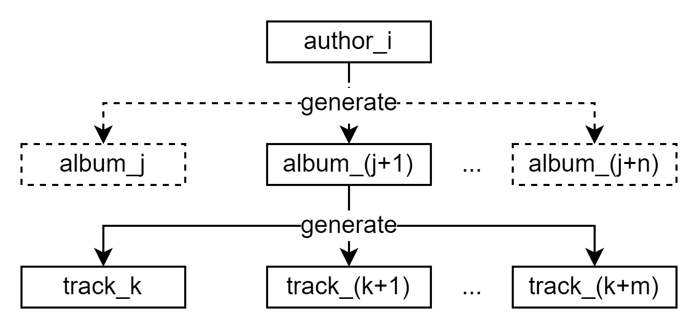
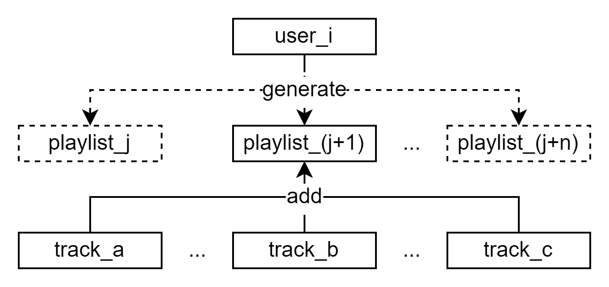

# Генерация тестовых данных

## Цели работы

Сформировать набор данных, позволяющий производить операции на реальных объемах данных.

## Программа работы

1. Реализация в виде программы параметризуемого генератора, который позволит сформировать набор связанных данных в каждой таблице.
2. Частные требования к генератору, набору данных и результирующему набору данных:
* количество записей в справочных таблицах должно соответствовать ограничениям предметной области
* количество записей в таблицах, хранящих информацию об объектах или субъектах должно быть параметром генерации
* значения для внешних ключей необходимо брать из связанных таблиц
* сохранение уже имеющихся данных в базе данных

## Ход работы

### Общие сведения

Язык программирования &mdash; `Java`. Драйвер `jdbc` подключен через зависимости [maven](pom.xml).

Способ генерации данных &mdash; смешанный:

* Фиксированные:
  * [50 жанров](src/main/java/util/table/Genre.java)
  * [13 стран](src/main/java/util/Country.java)
  
* Случайные:
  * Длительность трека (до 10 минут)
  * Текст трека (до 100 символов)
  * Дата релиза альбома (начиная с 1970-01-01)

* Не фиксированные и не случайные:
  * Атрибуты `title`/`name` у таблиц `author`, `album`, `track`, `user` и `playlist` имеют вид: `<table>_<id>` (пример: `author_1`). 
    Такой способ упрощает отладку и анализ сгенерированных записей.

Генрация связей и атрибутов:

* Случайная:
  * Случайная страна исполнителя
  * Случайный жанр исполнителя
  * Случайный жанр альбома
  
* Последовательная:
  * Генерируется исполнитель -> определяется случайное число альбомов:
    * Генерируется альбом -> определяется случайное число треков в альбоме (это число определяет тип альбома):
      * Генерируется трек
  * Генерируется пользователь -> определяется случайное число плейлистов:
    * Генерируется плейлист -> определяется случаное число треков в плейлисте:
      * В плейлист добавляются случайные (уже сгенерированные) треки
 
Сначала производится генерация исполнителей, а после &mdash; генерация пользователей.

Генерацию записей можно представить в виде древовидной структуры, где исполнитель &mdash; корень, а треки &mdash; это листья:



Аналогичное дерево/диаграмму можно построить и для генерации пользователей и плейлистов, разве что треки для плейлиста не генерируются, 
а добавляются уже сгенерированные (на диаграмме это также отображено):



В начале генерации производятся запросы `SELECT MAX(table_id) FROM table;` к таблицам `author`, `album`, `track`, `user` и `playlist` 
для определения начальных `id`. Это обеспечивает сохранение уже имеющийся записей и связей в БД: записи не будут
удалены или перезаписаны; не будут созданы новые связи для уже имеющихся записей (например, исполнителю не будет 
присвоен новый альбом).

### Программная реализация

#### Запуск

[Main](src/main/java/Main.java)

При запуске генератора указываются 6 обязательных параметров и 1 необязательный:

```
<authorNum> <maxAlbumsPerAuthor> <maxTracksPerAlbum> <userNum> <maxPlaylistsPerUser> <maxTracksPerPlaylist> [debug]
```

* `<authorNum>` &mdash; число генерируемых исполнителей
* `<maxAlbumsPerAuthor>` &mdash; максимальное число альбомов у исполнителя
* `<maxTracksPerAlbum>` &mdash; максимальное число треков в альбоме
* `<userNum>` &mdash; число генерируемых пользователей
* `<maxPlaylistsPerUser>` &mdash; максимальное число плейлистов у пользователя
* `<maxTracksPerPlaylist>` &mdash; максимальное число треков в плейлисте
* `[debug]` &mdash; необязательный параметр: если указан и не равен `0`, то генератор выводит формируемые SQL-запросы в стандартный поток вывода


#### Соединение с БД

[db](src/main/java/db)

Абстрактный класс `Connector` обеспечивает соединение с БД и позволяет выполнять/отправлять запросы. В конструктор
передаётся URL БД, имя пользователя и пароль.

Не включенный в Git класс `LocalConnector` &mdash; наследник `Connector` для локальной БД, который переопределяет конструктор, 
указывая URL локальной БД, имя пользователя и пароль:

```java
public class LocalConnector extends Connector {
    public LocalConnector() {
        super("jdbc:postgresql://localhost/db", "user", "password");
    }
}
```

#### Таблицы, типы, утилиты

Классы-аналоги таблиц и типов из БД, а также вспомогательные классы.

[util](src/main/java/util):

* [table](src/main/java/util/table) &mdash; таблицы
* [type](src/main/java/util/type) &mdash; типы
* [Country](src/main/java/util/Country.java) &mdash; перечисление 13 стран
* [Params](src/main/java/util/Params.java) &mdash; обёртка для параметров генератора
* [Tables](src/main/java/util/Tables.java) &mdash; создание экземпляров классов таблиц

#### Генерация данных и запросов

[generation](src/main/java/generation):
* [RandomGenerator](src/main/java/generation/RandomGenerator.java) &mdash; генератор случайных данных:
  * Случайное целочисленное значение
  * Случайный идентификатор жанра
  * Случайный идентификатор трека
  * Случайная страна (название страны исполнителя)
  * Случайная дата, начиная с `1970-01-01` (для даты релиза альбома)
  * Случайное время, не более 10 минут: `00:10:00` (длительность трека)
  * Случайная строка (в том числе `null`), включающая заглавные и прописные буквы и пробелы, общей длиной не более 100 символов (для текста трека)

* [QueryGenerator](src/main/java/generation/QueryGenerator.java) &mdash; формирователь SQL-запросов:
  * Запросы `INSERT` на вставку для всех таблиц (включает опцию `ON CONFLICT DO NOTHING`, используемую, в основном, для вставки жанров)
  * Запрос на выборку максимального идентификатора в таблице `SELECT MAX(table_id) FROM table;` (используется для сохранения уже имеющихся записей в БД)

#### Исполнение

[Inserter](src/main/java/Inserter.java) &mdash; соединяет все части программной реализации для непосредственного заполнения
БД генерируемыми записями (реализует описанный выше "древовидный алгоритм генерации"):
* Устанавливает соединение с БД при помощи экземпляра класса `LocalConnector` (описан в разделе [Соединение с БД](#соединение-с-бд))
* Инициализирует идентификаторы для таблиц `author`, `album`, `track`, `user` и `playlist`
* Осуществляет генерацию записей и отправку соответствующих запросов в БД

### Результаты

Запустим генератор с параметрами `2 3 7 2 3 7 1` и проанализируем содержимое таблиц:

`genre`

| genre_id | title             |
|---------:|:------------------|
|        1 | Pop               |
|        2 | Disco             |
|        3 | Synth Pop         |
|        4 | Rap               |
|        5 | Hip Hop           |
|        6 | Dance             |
|        7 | Electronic        |
|        8 | Techno            |
|        9 | House             |
|       10 | Trance            |
|       11 | Drum and Bass     |
|       12 | Dubstep           |
|       13 | Ambient           |
|       14 | New Age           |
|       15 | Alternative       |
|       16 | Hardcore          |
|       17 | Post Hardcore     |
|       18 | Rock              |
|       19 | New Wave          |
|       20 | Post Rock         |
|       21 | Progressive Rock  |
|       22 | Stoner Rock       |
|       23 | Folk Rock         |
|       24 | Hard Rock         |
|       25 | Rock and Roll     |
|       26 | Classical         |
|       27 | Metal             |
|       28 | Heavy Metal       |
|       29 | Progressive Metal |
|       30 | Epic Metal        |
|       31 | Folk Metal        |
|       32 | Gothic Metal      |
|       33 | Industrial Metal  |
|       34 | Post Metal        |
|       35 | Thrash Metal      |
|       36 | Death Metal       |
|       37 | Black Metal       |
|       38 | Doom Metal        |
|       39 | Alternative Metal |
|       40 | Nu Metal          |
|       41 | Metalcore         |
|       42 | Soft              |
|       43 | Lounge            |
|       44 | Jazz              |
|       45 | Blues             |
|       46 | R and B           |
|       47 | Country           |
|       48 | Punk              |
|       49 | Punk Rock         |
|       50 | Reggae            |

`author`

| author_id | title    | country   |
|----------:|:---------|:----------|
|         1 | author_1 | Ukraine   |
|         2 | author_2 | Australia |

`album`

| album_id | type   | title   | release    | author_id |
|---------:|:-------|:--------|:-----------|----------:|
|        1 | EP     | album_1 | 1990-03-27 |         1 |
|        2 | single | album_2 | 1998-12-29 |         2 |
|        3 | album  | album_3 | 2010-07-01 |         2 |
|        4 | EP     | album_4 | 1974-07-22 |         2 |

`track`

| track_id | title    | album_id | duration | lyrics                                                                                     |
|---------:|:---------|---------:|:---------|:-------------------------------------------------------------------------------------------|
|        1 | track_1  |        1 | 00:03:11 | DvHxOCIJWXXanDaXdQqLalfsGdVxErzCnQCUIuoXRsjuPjKM XQEjxGidUcrhUIETsSW                       |
|        2 | track_2  |        1 | 00:05:24 | kOZLvmwUygcVAWgJHwjAWTWGsPkZAuIRHSSqhCRvvjQbiJSIIdmzsapGVFCDLBVzQJnliPLQOksvzWKSw          |
|        3 | track_3  |        1 | 00:08:52 | UyenRsejpjiwBNPnayPveKsKYLsuBOLeYynnNgbYSBapvSyTXlMuxdeapGVNRaMhGPqSSBBhdTYAijKRm          |
|        4 | track_4  |        1 | 00:04:22 | lYVnIGgSxzxymjxTneHrSnngmGfOqUheSmXnswPnNGujnKslVnvcmTLKhPsJiJwsgUIcKnentAAYGnrJNA         |
|        5 | track_5  |        2 | 00:08:32 | ZhDyqmsHpXaFdQsaYzoQetYBeHYHmxhvMBYiMeNQY                                                  |
|        6 | track_6  |        3 | 00:08:33 | ghfGVNuRqrtDEQlZCvccFHebAILIbqngtpfePiCedLrVCeoG                                           |
|        7 | track_7  |        3 | 00:06:44 | JNUAUTPVYsaAz                                                                              |
|        8 | track_8  |        3 | 00:03:27 | OQAmfxWGRvLb LSKSFWwExcequYLmkFuFkKcApWbYjbmFGZ                                            |
|        9 | track_9  |        3 | 00:02:36 | OCDbQkgAQDOzhWaSgWMuGpRMKxVJcpejvSFE  QV                                                   |
|       10 | track_10 |        3 | 00:08:16 | NkpTgnpLAJYQIn YuLTZrFLY qJEAQdddMGlCKsywJujhAh UIPdasAleOKdewTLHg GwQrJkPGEBANhHKAMF      |
|       11 | track_11 |        3 | 00:01:01 | LiBvNerSgfBMMKviIcnUTSBt FaeGbNTfKZlctiFPcFAnwqlezvMgJcHQjqdetHDQaYrqCu MItrSBROcAdO       |
|       12 | track_12 |        4 | 00:05:12 | txwRdlhHFvgSXRUAlyMFCGlCwJVGzIqLVwnfGdVJrsQsPVqehzyopfMEHuKTCBUHypSURVmtrpqcbOQ            |
|       13 | track_13 |        4 | 00:07:10 | kepUE CXMZyMrlmisxjeXMseZxmOqjseDfTNboRsSlvRhjzNjXgm GbBgEguyjUAHPscGFQQVQf EkmtWHhjFHLBCc |
|       14 | track_14 |        4 | 00:08:17 | ntw fxepveMETsCIEOMbSkzHAIGmANeCo                                                          |

`author_genre`

| author_id | genre_id |
|----------:|---------:|
|         1 |       28 |
|         2 |       10 |

`album_genre`

| album_id | genre_id |
|---------:|---------:|
|        1 |       36 |
|        2 |       24 |
|        3 |       38 |
|        4 |       28 |

`author_track`

| author_id | track_id | type |
|----------:|---------:|:-----|
|         1 |        1 | main |
|         1 |        2 | main |
|         1 |        3 | main |
|         1 |        4 | main |
|         2 |        5 | main |
|         2 |        6 | main |
|         2 |        7 | main |
|         2 |        8 | main |
|         2 |        9 | main |
|         2 |       10 | main |
|         2 |       11 | main |
|         2 |       12 | main |
|         2 |       13 | main |
|         2 |       14 | main |

`user`

| user_id | name    |
|--------:|:--------|
|       1 | user_1  |
|       2 | user_2  |

`playlist`

| playlist_id | title      | user_id |
|------------:|:-----------|--------:|
|           1 | playlist_1 |       1 |
|           2 | playlist_2 |       2 |
|           3 | playlist_3 |       2 |
|           4 | playlist_4 |       2 |

`playlist_track`

| playlist_id | track_id |
|------------:|---------:|
|           1 |        3 |
|           2 |        7 |
|           2 |        2 |
|           3 |        5 |
|           3 |       14 |
|           3 |        3 |
|           3 |        1 |
|           3 |       11 |
|           4 |       10 |

Далее, не очищая таблицы, запустим генератор ещё раз для проверки сохранения уже записанных данных (параметры: `1 1 7 1 1 7 1`).
Проанализируем содержимое основных таблиц (таблиц-сущностей):

`genre`

| genre_id | title             |
|---------:|:------------------|
|        1 | Pop               |
|        2 | Disco             |
|        3 | Synth Pop         |
|        4 | Rap               |
|        5 | Hip Hop           |
|        6 | Dance             |
|        7 | Electronic        |
|        8 | Techno            |
|        9 | House             |
|       10 | Trance            |
|       11 | Drum and Bass     |
|       12 | Dubstep           |
|       13 | Ambient           |
|       14 | New Age           |
|       15 | Alternative       |
|       16 | Hardcore          |
|       17 | Post Hardcore     |
|       18 | Rock              |
|       19 | New Wave          |
|       20 | Post Rock         |
|       21 | Progressive Rock  |
|       22 | Stoner Rock       |
|       23 | Folk Rock         |
|       24 | Hard Rock         |
|       25 | Rock and Roll     |
|       26 | Classical         |
|       27 | Metal             |
|       28 | Heavy Metal       |
|       29 | Progressive Metal |
|       30 | Epic Metal        |
|       31 | Folk Metal        |
|       32 | Gothic Metal      |
|       33 | Industrial Metal  |
|       34 | Post Metal        |
|       35 | Thrash Metal      |
|       36 | Death Metal       |
|       37 | Black Metal       |
|       38 | Doom Metal        |
|       39 | Alternative Metal |
|       40 | Nu Metal          |
|       41 | Metalcore         |
|       42 | Soft              |
|       43 | Lounge            |
|       44 | Jazz              |
|       45 | Blues             |
|       46 | R and B           |
|       47 | Country           |
|       48 | Punk              |
|       49 | Punk Rock         |
|       50 | Reggae            |

`author`

| author_id | title    | country   |
|----------:|:---------|:----------|
|         1 | author_1 | Ukraine   |
|         2 | author_2 | Australia |
|         3 | author_3 | Norway    |

`album`

| album_id | type   | title   | release    | author_id |
|---------:|:-------|:--------|:-----------|----------:|
|        1 | EP     | album_1 | 1990-03-27 |         1 |
|        2 | single | album_2 | 1998-12-29 |         2 |
|        3 | album  | album_3 | 2010-07-01 |         2 |
|        4 | EP     | album_4 | 1974-07-22 |         2 |
|        5 | EP     | album_5 | 1976-05-13 |         3 |

`track`

| track_id | title    | album_id | duration | lyrics                                                                                     |
|---------:|:---------|---------:|:---------|:-------------------------------------------------------------------------------------------|
|        1 | track_1  |        1 | 00:03:11 | DvHxOCIJWXXanDaXdQqLalfsGdVxErzCnQCUIuoXRsjuPjKM XQEjxGidUcrhUIETsSW                       |
|        2 | track_2  |        1 | 00:05:24 | kOZLvmwUygcVAWgJHwjAWTWGsPkZAuIRHSSqhCRvvjQbiJSIIdmzsapGVFCDLBVzQJnliPLQOksvzWKSw          |
|        3 | track_3  |        1 | 00:08:52 | UyenRsejpjiwBNPnayPveKsKYLsuBOLeYynnNgbYSBapvSyTXlMuxdeapGVNRaMhGPqSSBBhdTYAijKRm          |
|        4 | track_4  |        1 | 00:04:22 | lYVnIGgSxzxymjxTneHrSnngmGfOqUheSmXnswPnNGujnKslVnvcmTLKhPsJiJwsgUIcKnentAAYGnrJNA         |
|        5 | track_5  |        2 | 00:08:32 | ZhDyqmsHpXaFdQsaYzoQetYBeHYHmxhvMBYiMeNQY                                                  |
|        6 | track_6  |        3 | 00:08:33 | ghfGVNuRqrtDEQlZCvccFHebAILIbqngtpfePiCedLrVCeoG                                           |
|        7 | track_7  |        3 | 00:06:44 | JNUAUTPVYsaAz                                                                              |
|        8 | track_8  |        3 | 00:03:27 | OQAmfxWGRvLb LSKSFWwExcequYLmkFuFkKcApWbYjbmFGZ                                            |
|        9 | track_9  |        3 | 00:02:36 | OCDbQkgAQDOzhWaSgWMuGpRMKxVJcpejvSFE  QV                                                   |
|       10 | track_10 |        3 | 00:08:16 | NkpTgnpLAJYQIn YuLTZrFLY qJEAQdddMGlCKsywJujhAh UIPdasAleOKdewTLHg GwQrJkPGEBANhHKAMF      |
|       11 | track_11 |        3 | 00:01:01 | LiBvNerSgfBMMKviIcnUTSBt FaeGbNTfKZlctiFPcFAnwqlezvMgJcHQjqdetHDQaYrqCu MItrSBROcAdO       |
|       12 | track_12 |        4 | 00:05:12 | txwRdlhHFvgSXRUAlyMFCGlCwJVGzIqLVwnfGdVJrsQsPVqehzyopfMEHuKTCBUHypSURVmtrpqcbOQ            |
|       13 | track_13 |        4 | 00:07:10 | kepUE CXMZyMrlmisxjeXMseZxmOqjseDfTNboRsSlvRhjzNjXgm GbBgEguyjUAHPscGFQQVQf EkmtWHhjFHLBCc |
|       14 | track_14 |        4 | 00:08:17 | ntw fxepveMETsCIEOMbSkzHAIGmANeCo                                                          |
|       15 | track_15 |        5 | 00:05:15 | hqqpDrmIOLKXPCSaHWSzvQmkCJKFDOXog mgStmWYrrmtGCcOeAmacLVOSXHer                             |
|       16 | track_16 |        5 | 00:09:16 | tcCCOFDADgHxJsKxcfrrpKXHzztVzVAQXOyNIQfitBnvcpDIYBTVqDuTenDStADgxATEUuiqYGfPovSagC         |

`user`

| user_id | name   |
|--------:|:-------|
|       1 | user_1 |
|       2 | user_2 |
|       3 | user_3 |

`playlist`

| playlist_id | title      | user_id |
|------------:|:-----------|--------:|
|           1 | playlist_1 |       1 |
|           2 | playlist_2 |       2 |
|           3 | playlist_3 |       2 |
|           4 | playlist_4 |       2 |
|           5 | playlist_5 |       3 |

При повторном запуске генератор отработал корректно: предыдущие записи остались, а новые были записаны в конец таблицы.
В таблице `genre` содержимое осталось прежним, т. к. поля уникальны и все жанры, предусмотренные генератором, уже 
содержались в таблице, а исключений и ошибок не возникло благодаря использованию опции `ON CONFLICT DO NOTHING` 
при формировании запроса на вставку `INSERT`.

## Выводы

В ходе лабораторной работы разработан параметризированный генератор данных на языке `Java` с использованием драйвера `jdbc`. 
Генератор позволяет сформировать набор данных реального объёма, при этом удовлетворяет заданным условиям, важнейшим из которых
является сохранение уже имеющихся в БД данных. При выполнении (написании генератора) практически изучены способы и принципы
взаимодействия с БД программными методами с помошью библиотеки `java.sql`.